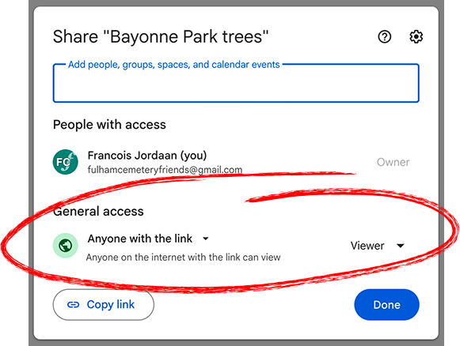

# 1. Set up your Google Sheet

The map reads its data from a Google Sheet you control. This step takes about
5 minutes.

## 1.1 Copy the template

Open the **[park-treemap Trees template](https://docs.google.com/spreadsheets/d/1PVzp_l5RKAYZDWJrBaZ0418P7LMPQKsEIBxTov6Znd0/edit?usp=sharing)** and click:

```
File → Make a copy
```

Give it a name like *"My Park trees"* and save it to your own Google Drive.

The template comes with:

- A **`Trees`** worksheet with all the required column headers in row 1.
  - **Row 2** is reserved for two ARRAYFORMULA cells — one in the `Ref`
  column, one in the `Google Maps link` column. Each one computes its
  value for every tree row automatically.
  - **Tree data starts at row 3**, and the app appends new trees from
  there.
- A **`Feedback`** worksheet where comments submitted by users will appear.

> ⚠️ **Don't overwrite the formula cells in row 2** of the `Ref` or
> `Google Maps link` columns. They populate the entire column
> automatically. If row 2 gets damaged, see
> [docs/05](05-database-fields.md#dont-touch-these) for how to recover.

## 1.2 Make the sheet readable by anyone with the link



> ⚠️ **Without this step the map will be empty.** This is the single
> most important setting in the whole setup.

The map fetches your tree data by URL — it can't sign in to your
Google account. So the sheet needs to allow read access without
signing in.

1. Click the **Share** button (top right of the sheet).
2. Under **General access**, change *Restricted* to **Anyone with the
   link**.
3. Make sure the role on the right is set to **Viewer**.
4. Click **Done**.

This only makes the sheet *readable* to anyone who already knows the
URL — it doesn't make it editable, and nobody can find it by
searching.

## 1.3 Copy the Sheet ID

Look at the spreadsheet's URL in your browser:

```
https://docs.google.com/spreadsheets/d/16056CHjRL4-hbd4hbIb1czvrryGKcwMFYWCDeMDDAHM/edit
                                       ^─────────────── this part ────────────────^
```

The long string between `/d/` and `/edit` is your **Sheet ID**. Copy it —
you'll need it in step 4.

## Next

→ [Step 2: Fork the GitHub repository](02-fork-github-repo.md)
