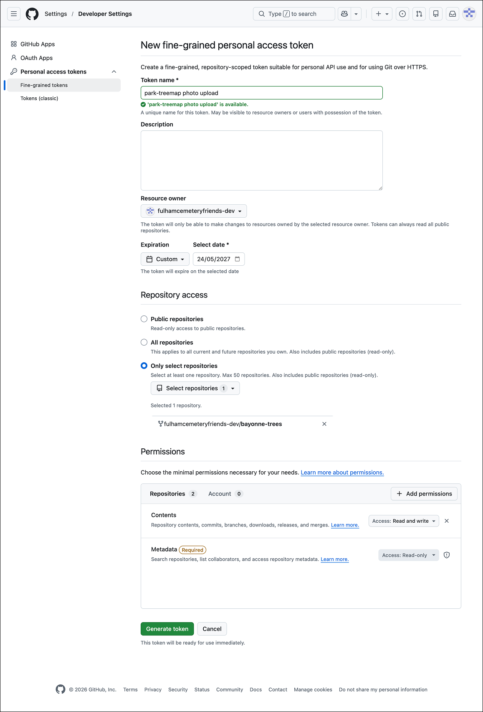
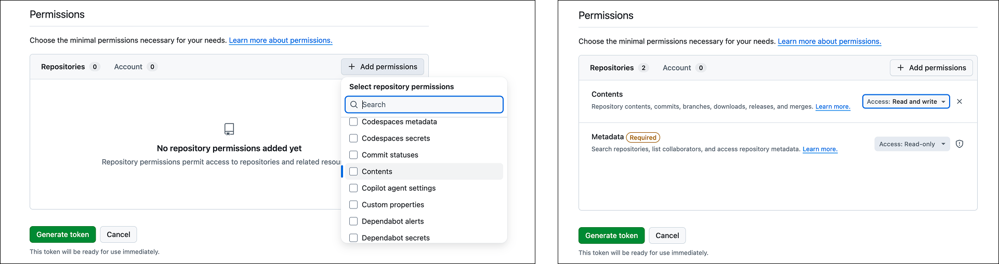
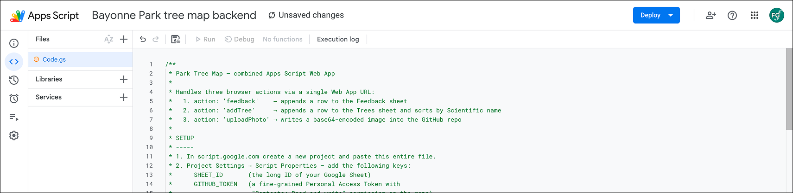
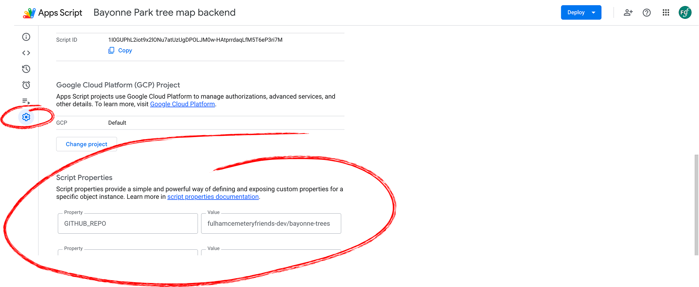
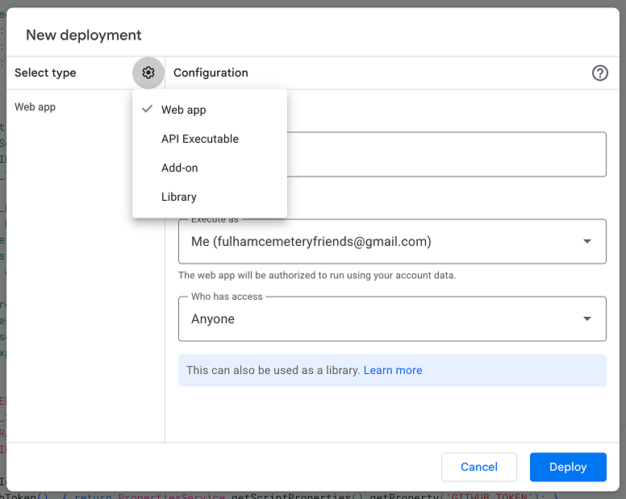
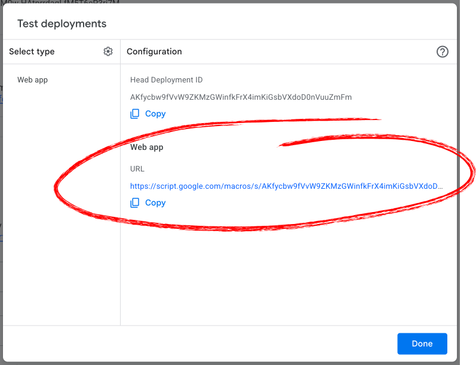

# 3. Create the Apps Script

Apps Script is a tiny program that lives next to your Google Sheet. It does
three things:

1. Adds a new row when someone clicks *"Add a tree"* on the map.
2. Adds a new row to a *Feedback* sheet when someone sends feedback.
3. Uploads photos to your GitHub repository so they appear in the map popups.

This is the most fiddly step. Take it slowly, and you only do it once.

## 3.1 Create a fine-grained GitHub Personal Access Token



The Apps Script needs permission to write photo files into your GitHub repo.
We give it permission via a *fine-grained* Personal Access Token (PAT) that
can **only** touch the one repository — much safer than a classic token.

1. Go to <https://github.com/settings/personal-access-tokens/new>.
2. **Token name**: e.g. *park-treemap photo upload*.
3. **Description**: optional, e.g. *"Used by the Apps Script that
   uploads tree photos to my park-treemap repo."*
4. **Resource owner**: choose your account (the one that owns the fork).
5. **Expiration**: 1 year is reasonable. The dropdown doesn't have a
   1-year option — choose **Custom** and pick a date a year from now.
   Set a calendar reminder for the day before it expires (see
   [Troubleshooting](10-troubleshooting.md) for what happens if you
   forget).
6. **Repository access**: *Only select repositories* → pick your forked repo.
7. **Permissions**: click the **Add permissions** button, then under
   *Repository permissions* set: **Contents**: **Read and write** (Everything else: ignore.
   GitHub will also add **Metadata** — ignore.)
   
8. Click **Generate token**, then copy the long string starting with
   `github_pat_…`. **You won't be able to see it again** — copy it somewhere
   safe while you complete this step.

## 3.2 Create the Apps Script project

1. Go to <https://script.google.com> and click **New project**.
2. Replace the placeholder `myFunction` code with the entire contents of
   [`apps-script.gs`](../apps-script.gs) from your forked repo.
   > 💡 On the GitHub page for `apps-script.gs`, click the **Raw**
   > button (top-right of the file viewer) first. That opens the file
   > as plain text — *Select All → Copy* then gets exactly the code,
   > with no line numbers or other GitHub UI mixed in.
3. Rename the project (top-left, *"Untitled project"*) to e.g.
   *"Park Tree Map backend"*.
4. Save (Ctrl+S / Cmd+S).



## 3.3 Set the Script Properties



The script reads three values from *Script Properties* — never paste
them into the script body itself, where they'd be readable by anyone
who can view the project.

> 💡 **These live inside Apps Script, not in your `config.js`.**
> Some of the same names appear in both files (`SHEET_ID`,
> `GITHUB_REPO`), but the two copies are completely separate — Apps
> Script can't see your `config.js`, and your `config.js` can't see
> Apps Script. **Both have to be set, with the same values.**

1. Click the **gear icon** (Project Settings) in the left sidebar.
2. Scroll to **Script Properties** and click **Add script property**.
3. Add four properties:

   | Property            | Value                                                                                       |
   |---------------------|---------------------------------------------------------------------------------------------|
   | `SHEET_ID`          | The Sheet ID you copied in step 1.3.                                                        |
   | `GITHUB_REPO`       | `your-username/my-park-trees` — **the full owner/repo pair, separated by a slash.** `your-username` alone won't work. |
   | `GITHUB_TOKEN`      | The `github_pat_…` token from step 3.1.                                                     |
   | `CONTRIBUTOR_TOKEN` | A memorable password of your choice — e.g. `friends-2026-acorn`. This stops random visitors from being able to add trees or upload photos to your map. Anyone you want to give "Add a tree" rights to will use a magic link containing this password. See [docs/12](12-trusted-contributors.md) for the full picture. |

4. **Save script properties**.

> 💡 Don't want any access control? If you'd rather leave your map
> fully open (anyone with the URL can add trees), skip
> `CONTRIBUTOR_TOKEN` here and set `ENABLE_CONTRIBUTOR_GATE = false`
> in `config.js` later (step 4). See
> [docs/12](12-trusted-contributors.md) for the trade-offs.

## 3.4 Deploy as a Web App



1. Click **Deploy → New deployment** (top right).
2. Click the **gear icon** next to *Select type* and choose **Web app**.
3. Fill in:
   - **Description**: e.g. *v1*.
   - **Execute as**: *Me* (your account).
   - **Who has access**: *Anyone*.
4. Click **Deploy**.
5. The first time, Google will ask you to authorise the script. Click
   **Authorize access**, choose your account, and click *Advanced → Go to
   (project name) (unsafe)* (this warning is normal for your own scripts).
7. A *"Select what (your-name) can access"* screen appears listing the
   permissions the script needs. Tick **Select all**, then click
   **Continue**, then **Allow** on the final summary.
   
9. After deployment, copy the **Web app URL**. You'll paste this into
   `config.js` in step 4.
   > ⚠️ Copy the **whole URL**, not just the deployment ID. 

## 3.5 Sanity check

Open the **Web app URL** in a browser tab. You should see:

```json
{"status":"ok","message":"Park Tree Map Apps Script is running."}
```

If you see an HTML error page instead, double-check that *Who has access* is
set to *Anyone* (step 3.4).

## Next

→ [Step 4: Configure the app](04-configure-app.md)
